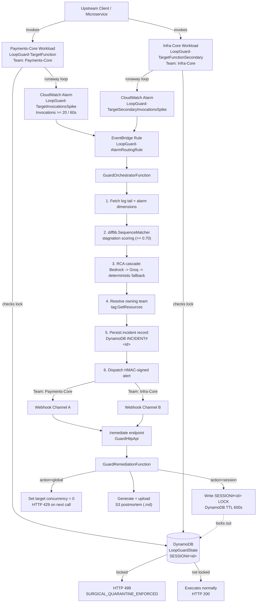
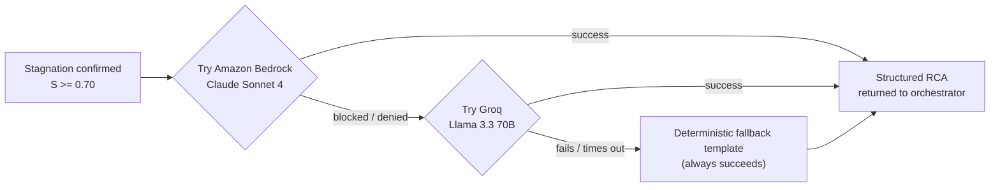

# LoopGuard


**Real-time, alarm-triggered circuit breaker and surgical session isolation for serverless and AI agent pipelines on AWS.**

Built for **First Commit** (Bharat Builds Tour × AWS Builder Center) · Team **Kroid** · Track: **Ship It**

📺 **https://youtu.be/TO0MQRAhGds**  · 💻 **[Live Repo](https://github.com/kp183/loopguard)**

---

## Table of Contents

- [The Problem](#the-problem)
- [What LoopGuard Actually Does](#what-loopguard-actually-does)
- [Architecture](#architecture)
- [The Diagnostic Cascade](#the-diagnostic-cascade--detect-first-explain-second)
- [Remediation: Two Different Blast Radii](#remediation-two-different-blast-radii)
- [Native AWS Recursion Detection vs. LoopGuard](#native-aws-recursion-detection-vs-loopguard)
- [Core AWS Services](#core-aws-services)
- [How This Differs From Prior Work](#how-this-differs-from-prior-work)
- [Known Limitations](#known-limitations-stated-plainly-not-discovered-by-a-judge-reading-the-code)
- [Quickstart & Deployment](#quickstart--deployment)
- [Verification Walkthrough](#verification-walkthrough)
- [Team & Submission](#team--submission)

---

## The Problem

Serverless and AI agent pipelines don't usually fail by crashing. They fail by **looping**.

- A Lambda function writes output back to the same S3 prefix that triggers it — and re-triggers itself, over and over.
- An LLM agent hits a tool error, doesn't crash, and instead reformulates the *same* failing query five different ways — burning tokens on every attempt, often while still returning a healthy `HTTP 200`.

Standard tooling is structurally blind to this:

| Failure mode | Why existing tools miss it |
|---|---|
| **Reporting latency** | AWS Cost Anomaly Detection and CUR-based billing tools update on an **8–24 hour delay**. By the time an alert fires, the cost is already on the invoice. |
| **Metric blindness** | CloudWatch alarms watch raw invocation count and error rate. An agent stuck in a semantic retry loop can return `200 OK` on *every single call* — the system looks perfectly healthy from the outside while it burns money. |
| **Blunt remediation** | The standard fix — `PutFunctionConcurrency(0)` or an account-level IAM deny policy — stops the function for **every caller**, not just the one broken session. |

LoopGuard exists to close that specific gap: detect the loop *while it's happening*, diagnose *why*, route the alert to whoever owns it, and remediate at the **narrowest blast radius that actually solves the problem**.

---

## What LoopGuard Actually Does

1. **Detects** a runaway invocation spike via a live CloudWatch alarm — not a next-day billing report.
2. **Scores** whether the repeated calls are genuinely stuck (near-identical arguments) using fuzzy string matching on the log tail, not just a raw invocation count.
3. **Diagnoses** the likely root cause using an LLM, with a documented, tested fallback chain if the model call fails.
4. **Routes** the alert automatically to the team that owns the misbehaving resource, based on its AWS tags.
5. **Remediates** with a human clicking one of two links: a **surgical**, session-scoped quarantine that leaves every other user unaffected, or a **global** kill switch for when it's a systemic bug, not one bad session.
6. **Resets** cleanly in seconds, so the whole system can be re-triggered and re-verified on demand.

---

## Architecture



**Reading the diagram:** the top half is the *target workloads* being watched. The moment one loops, a CloudWatch alarm crosses into EventBridge, which wakes the orchestrator — that's the "brain" doing detection, scoring, diagnosis, and routing. The bottom half is what happens after a human clicks a link in the resulting alert: either a scoped lock (the function itself checks this lock and refuses to keep looping) or an account-wide throttle.

---

## The Diagnostic Cascade — Detect First, Explain Second

The stagnation score (`difflib.SequenceMatcher`, comparing recent tool-call arguments) is what actually *decides* something is wrong — this part runs every time and always produces a real number from real data.

What generates the **human-readable explanation** of *why* is a three-tier cascade, so a blocked or rate-limited model can never take the whole pipeline down:



**Honest status for this submission:** Amazon Bedrock access was blocked throughout the event window by an AWS Marketplace billing constraint (`INVALID_PAYMENT_INSTRUMENT` — a known issue with AISPL-issued Indian debit cards and RBI e-mandate rules for recurring international Marketplace subscriptions). The event organizers explicitly confirmed Bedrock is not mandatory and that non-AWS AI tooling is permitted. Every incident in this submission's live verification was diagnosed via the **Groq** tier of the cascade — the Bedrock code path exists, is exercised on every incident (and fails fast, in under a second), and remains ready for when access clears.

---

## Remediation: Two Different Blast Radii

This is the core differentiation claim, and it's the one thing in this project that's been proven live, repeatedly, not just asserted:

| | **Surgical (`action=session`)** | **Global (`action=global`)** |
|---|---|---|
| **Mechanism** | DynamoDB TTL lock on one `session_id` | `PutFunctionConcurrency(0)` on the whole function |
| **Blast radius** | That one session only | Every caller of that function |
| **Verified live result** | Quarantined session → `HTTP 499` · Unrelated concurrent session → `HTTP 200` | Any subsequent call → `HTTP 429` |
| **When to use it** | One session is misbehaving | The code itself has a systemic bug |

Both actions are reached via a signed, one-time link in the alert — **remediation is human-approved by default**, not autonomous. An opt-in `AUTONOMOUS_MODE` flag exists in code (auto-quarantine when the stagnation score crosses a threshold) but ships **disabled by default** in this submission and has not been demonstrated live.

---

## Native AWS Recursion Detection vs. LoopGuard

A fair question: doesn't AWS Lambda already detect recursive loops? Yes, partially — and this table is the honest answer to that question, not a sales pitch:

| Dimension | AWS Native Lambda Recursion Detection | LoopGuard |
|---|---|---|
| **Mechanism** | Tracks a 16-hop counter in the `X-Amzn-Trace-Id` header | CloudWatch invocation velocity + fuzzy argument stagnation scoring |
| **Covered event sources** | Direct Lambda ↔ SQS ↔ SNS ↔ S3 chains only | Protocol-agnostic — works across EventBridge, API Gateway, DynamoDB Streams, and self-invoking agent loops |
| **Semantic / `HTTP 200` loops** | Blind to it — a loop that returns success on every call isn't a "recursive invocation" by AWS's definition | Specifically designed to catch this case — the entire reason the stagnation score exists |
| **Blast radius on trip** | Drops all subsequent invocations for the function | Isolates one `session_id`; everything else keeps running |

---

## Core AWS Services

| Service | Role |
|---|---|
| **AWS Lambda** | Target workloads, orchestrator, remediation function |
| **Amazon CloudWatch** | Invocation-velocity alarms, structured log source |
| **Amazon EventBridge** | Routes alarm state changes to the orchestrator |
| **AWS Resource Groups Tagging API** | Resolves which team owns a misbehaving function |
| **Amazon Bedrock & Groq** | Two-tier live diagnosis, with a deterministic backstop |
| **Amazon DynamoDB** | Incident records + session-scoped TTL quarantine locks |
| **Amazon S3** | Auto-generated incident postmortems, pre-signed download links |
| **Amazon API Gateway** | Authenticated `/remediate` endpoint, HMAC-verified |

---

## How This Differs From Prior Work

| Compared to | Key difference |
|---|---|
| **AWS-native tooling** (Budgets, Cost Anomaly Detection) | Sub-60-second, in-band detection vs. an 8–24 hour billing-report delay; session-scoped remediation vs. account-wide |
| **Prior hackathon submissions in this space** | Detects argument-level *reformulation*, not just raw invocation count — the difference between "did this fire 20 times" and "is it saying the same thing 20 different ways" |
| **This author's own prior projects** (Clarity, AgentLens) | LoopGuard watches live infrastructure and acts on it; the earlier projects are observability tools a human reads afterward. Zero shared code, framework, or dependencies. |

---

## Known Limitations (stated plainly, not discovered by a judge reading the code)

- **Remediation is human-gated by default.** Nothing acts on your infrastructure without a click, unless `AUTONOMOUS_MODE` is explicitly enabled — which it isn't, in this submission.
- **Bedrock never ran live during this event window** — see the Diagnostic Cascade section above. The code path exists and is exercised (and fails fast) on every incident.
- **The target function has no reserved concurrency ceiling.** Protection comes from the CloudWatch alarm and the session-lock quarantine, not from a hard cap.
- **Stagnation scoring has been validated against one healthy-traffic benchmark** (10 varied calls, well below threshold) but not against highly similar *legitimate* traffic, such as polling or paginated requests — a known edge case for future work.
- **The "agent" in this demo is a scripted Lambda** cycling through fixed query variants to reliably reproduce a stagnation pattern on camera, not a live Bedrock Agent with real tool-calling.

---

## Quickstart & Deployment

### Prerequisites

- AWS CLI, configured
- AWS SAM CLI (`sam --version >= 1.100.0`)
- Python 3.11 or 3.12
- *(Optional)* Amazon Bedrock model access for Claude — **not required to run this project.** LoopGuard fails over to Groq, and then to a deterministic diagnostic, if Bedrock is unavailable.
- *(Optional but recommended)* A Groq API key — [console.groq.com](https://console.groq.com)

### Deploy

```bash
git clone https://github.com/kp183/loopguard.git
cd loopguard
sam build

# Option A — guided, interactive
sam deploy --guided

# Option B — from a config file
cp samconfig.toml.example samconfig.toml
# edit samconfig.toml with your own values, then:
sam deploy
```

**Parameters you'll be asked for:**

| Parameter | What it's for |
|---|---|
| `WebhookUrlPrimary` / `WebhookUrlSecondary` | Where alerts land for each simulated team |
| `RemediationAuthToken` | HMAC secret for `/remediate` — generate with `python -c "import secrets; print(secrets.token_hex(32))"` |
| `BedrockModelId` | Which Bedrock model to attempt first (optional) |
| `GroqApiKey` | Enables the live Groq failover tier (optional but recommended) |
| `AutonomousMode` | `false` by default — remediation stays human-approved |
| `AutonomousStagnationThreshold` | Only relevant if autonomous mode is enabled |

---

## Verification Walkthrough

### 0. Run the test suite

```bash
python -m unittest discover tests/
```

18 tests, covering stagnation scoring, team-routing resolution and fallback, Groq failover behavior, and a healthy-traffic false-positive check.

### 1. Trigger a runaway loop

```bash
aws lambda invoke --function-name LoopGuard-TargetFunction \
  --invocation-type Event --cli-binary-format raw-in-base64-out \
  --payload '{"runaway_mode": true, "session_id": "sess-demo-01"}' out.json
```

### 2. Watch it get diagnosed and routed

```bash
sam logs -n LoopGuard-OrchestratorFunction --tail
```

You'll see the alarm fire, the stagnation score compute, the diagnostic cascade attempt Bedrock then fail over, the owning team resolve via the Tagging API, and the alert dispatch to the correct webhook.

### 3. Remediate — surgically

Click the `action=session` link from the alert (or hit it directly with `curl`). Re-invoke with the same `session_id` → `HTTP 499`. Invoke with a *different* session on the *same function*, at the same time → `HTTP 200`. That's the whole "surgical, not blunt" claim, provable on screen.

### 4. Remediate — globally

Click the `action=global` link. Any subsequent call to that function → `HTTP 429`.

### 5. Reset

```bash
python scripts/reset_demo.py
```

Clears concurrency overrides, resets both alarms to `OK`, purges quarantine locks — in under 6 seconds.

---

## Team & Submission

**Team Kroid** · Kunal Ghanchi ([@kp183](https://github.com/kp183))

Submitted to **First Commit**, event 1 of the WeMakeDevs × AWS Builder Center **Bharat Builds Tour** — September 17–20, 2026.

- Event page: [wemakedevs.org/aws/first-commit](https://www.wemakedevs.org/aws/first-commit)
- Track: **Ship It** (deployed, live AWS)

---

## License

MIT — see [LICENSE](./LICENSE).
